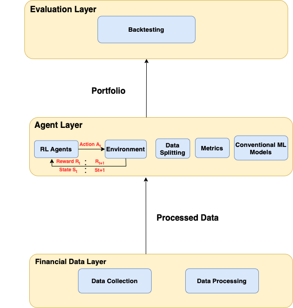
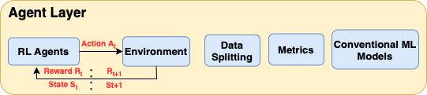
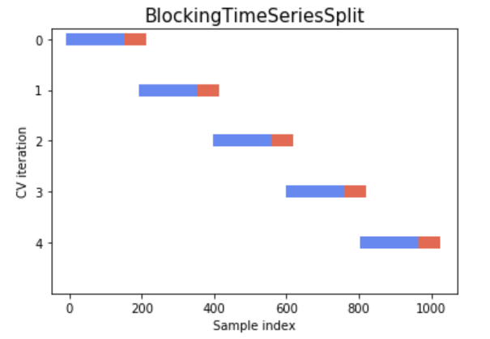
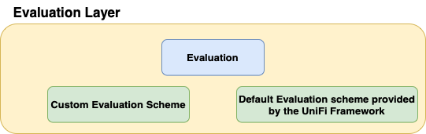

# UniFi: A Unified Framework for Portfolio Management
"UniFi" is a portfolio management framework that consists of several machine learning and deep reinforcement learning models accompanied by data collection, preparation and backtesting utilities. 
The uniFi framework also provides enough flexibility for users to implement their own mechanism and integrate it into the system.




The proposed framework is structured in three sequential layers: Financial Data Layer, Agent Layer, and the Evaluation Layer. 

# Layers of the UniFi Framework

## Financial Data Layer


Financial Data Layer handles all of the operations which are related to data itself. It contains two main sections namely DataCollection and DataProcessing. DataCollection module consists of methods that assists users with DataCollection. Currently, UniFi provides methods for downloading data from Yahoo Finance API, or uploading customized data from a file. Supported file types are: JSON, CSV, and XLSX.


Data Processing Module has methods for processing data. UniFi comes with default feature engineering methods. Default feature engineering adds the followings as features:
1. Technical indicators
2. Volatiliy index
3. Turbulance
4. Covariances
5. Return Values

It also provides a method for cleaning the data. 
In addition of default features that comes with UniFi, it also creates an evrionment where users can apply their own feature engineering methodology via Custom Feauture Engineer Module. This module provides functions for users to implement their own feature engineering strategy. 

## Agent Layer



This layer handles all of the methods related to agents to be trained. Agent Layer contains ConventionalAgents, RLAgents, Environment, DataSplitter, metrics and TestDir modules.

### 1. Conventional Agent Module 

Conventional Agent Module, implements several conventional agents. These agent have been implemented with the help of "scikit-learn" library. Support agents are the following:
1. Decision Tree Agent
2. Huber Regression Agent
3. Linear Regression Agent
4. Support Vector Regressor Agent
5. Random Forest Agent

All the agents mentioned above follows the same interface hence they all have the same structure. This makes the extension of the system easier. One could implement his/her own machine learning agent and integrate it to the system as long as it follows the same structure. 

### 2. Reinforcement Learning Agent Module

RLAgents section contains reinforcement learning agents. Here we made use of "stable.baselines" API. Supported agents are:
1. A2C
2. DDPG
3. PPO
4. TD3

This module has a similar scheme as the conventional agent module regarding the use of interfaces. Since, everything inherits the same structure, the extension and customization of the module is fairly easy.

### 3. Environment Module

Envrionment module contains methods for implementing the necessary environment for RL agents to learn. It comes with a default implementation of portfolio allocation envrionment.

### 4. Data Splitter Module

Since the data that we are tackling with is time-series data, special data splitting methods are in need. These customized data splitting methods which are tailored for time-series data have been implemented in this module. It currently supports Time Series Splitter and Blocking Time Series Splliter functionalities.



### 5. Metrics Module
Metrics section implements several error metrics as methods. Here again we use the help of sckit-learn library.
Provided regression metrics are the following:
1. Max Error
2. Mean Absolute Error
3. Mean Squared Error
4. Mean Squared Log Error
5. Median Absolute Error
6. R^2 Score
7. Explained Varience Score
8. Mean Tweedie Deviance
9. Mean Poisson Deviance
10. Mean Gamma Deviance


## Evaluation Layer



Objective of the Evaluation Layer, as the name suggests, is to evaluate the portoflio that has been produces by the agent. It provides methods for applying backtesting, and for visualization. Default portfolio evaluator module helps users compare multiple agents against an exogenous index like Dow Jones Index. However, extended portfolio evaluator module provides methods for comparing multiple agents against the passive strategy (uniform buy and hold), and it also provides additional probabilistic analysis. 

Here an example visualization: 

#TODO: Add figures and figure out how to change the size of it :(

# Requirements

Before you run UniFi make sure you have the following requirements:
```
pandas~=1.4.2
numpy~=1.22.4
matplotlib~=3.5.2
empyrical~=0.5.5
seaborn~=0.11.2
ipython~=8.3.0
pytz~=2021.3
scipy~=1.7.3
nbformat~=5.3.0
scikit-learn~=1.0.2
setuptools~=59.5.0
pyyaml~=6.0
torch~=1.11.0
gym~=0.21.0
tensorflow~=2.8.0
stockstats~=0.4.1
yfinance~=0.1.70
```

# Download UniFi

For downloading the UniFi framework, copy paste the following command to your command line.

```
git clone https://github.com/didemdurukan/uniFi.git
```


